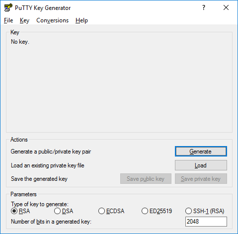
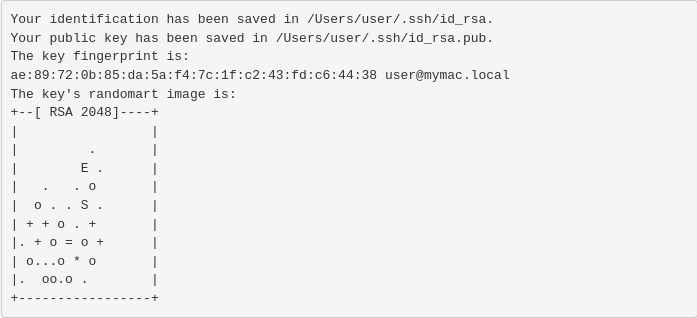

How to generate an SSH key pair?
================================

An SSH key pair consists of two keys, namely, the public key and the
private key. The public key is stored in the SSH directory of the HPC
facility, while the private key remains with the user. Users are
requested to safeguard the private key carefully. Note that the file
name of the public key is same as the private key except that the public
key has a file extension `.pub`. For example, if the file name of the
SSH private key is `id_rsa`, then the file name of the public key would
be `id_rsa.pub`.

On Windows: Using PuTTY {#on-windows-using-putty .unnumbered}
-----------------------

Users are recommended to use PuTTY to access SSH in Windows. The
installer for PuTTY can be downloaded from
[this](https://www.puttygen.com/download-putty) website. Within this
link, please choose the MSI 64-bit ('Windows Installer for putty')
version of the package.

-   Once installation is complete, go to
    `Start Menu -> All Programs -> PuTTYgen` and then launch the
    application. Figure [1](#PuTTY-gen){reference-type="ref"
    reference="PuTTY-gen"} shows the screenshot of the launched
    application.

-   For the type of key to generate, please select RSA and click
    **Generate**, and start moving the mouse within the Window. Putty
    uses the mouse movements to collect randomness. Note that on older
    machines, please select SSH-2 (RSA) if RSA is not available.

-   Once the progress bar becomes full, the actual key generation takes
    place. This process may take few seconds to several minutes. When
    complete, the public key should appear in the Window. You can
    specify a passphrase for the key (Optional).

-   Under Actions click on the **Save public key** and **Save private
    key** to save your public and private keys respectively.

-   Please share the public key with the system administrator, who will
    copy it to the SSH directory of the HPC facility.

{#PuTTY-gen}

On Windows: Using Windows 10 OpenSSH Client {#on-windows-using-windows-10-openssh-client .unnumbered}
-------------------------------------------

Microsoft, from **Windows 10** build **1803** and onwards have shipped
OpenSSH Client on all Windows 10 PCs. Users can use the OpenSSH
`ssh-keygen` command to generate their SSH keys. The following steps
will help in generating the SSH keys.

-   Press `Windows Key + R` to open the Windows Run Prompt.

-   Type `cmd` and press ENTER.

-   Type `ssh-keygen` in the console and press ENTER.

-   In order to generate the SSH key pair and store them securely,
    Windows may prompt you to enter a directory where the key pair will
    be stored. You may press Enter to choose the default location
    provided.

-   Next, you'll be prompted to enter your passphrase for the key
    (Optional).

-   Once the process is completed, two files will be generated along
    with the `SHA256` fingerprint. The key's random art image will also
    be displayed on-screen. A sample screenshot is shown in Figure
    [2](#windows-key-art){reference-type="ref"
    reference="windows-key-art"}. Note that the generated image and
    fingerprint will differ from system to system.

-   Please share the public key with the system administrator, who will
    copy it to the SSH directory of the HPC facility.

{#windows-key-art}

On macOS {#on-macos .unnumbered}
--------

Users are recommended to use the `Terminal` application to generate ssh
key pairs. It is located in the utilities which can be accessed using
the Finder.

-   Open Terminal and enter `ssh-keygen -t rsa`.

-   This starts the key generation process. The utility may also prompt
    you to indicate where to store the key pair. Press ENTER to accept
    the default location.

-   Next, you'll be prompted to enter your passphrase for the key
    (Optional).

-   Once the process is completed, two files will be generated along
    with the `SHA256` fingerprint. The key's random art image will be
    displayed on-screen. A sample screenshot generated on a mac system
    is shown in Figure [3](#macOS-key){reference-type="ref"
    reference="macOS-key"}. Note that the generated image and
    fingerprint will differ from system to system.

-   Please share the public key with the system administrator, who will
    copy it to the SSH directory of the HPC facility.

    {#macOS-key}

On Linux {#on-linux .unnumbered}
--------

To generate `ssh` keys on a Linux based operating system,

-   Open a Terminal or Console and enter `ssh-keygen -t rsa`.

-   The utility will now prompt you to enter the location where to save
    the key pair. Press ENTER to accept the default location.

-   Next, you'll be prompted to enter your passphrase for the key
    (Optional).

-   Once the process is completed, two files will be generated along
    with the `SHA256` fingerprint. The key's random art image will also
    be displayed on-screen. A sample screenshot generated on a linux
    system is shown in Figure [4](#Linux-key){reference-type="ref"
    reference="Linux-key"}. Note that the generated image and
    fingerprint will differ from system to system.

-   Please share the public key with the system administrator, who will
    copy it to the SSH directory of the HPC facility.

{#Linux-key}
