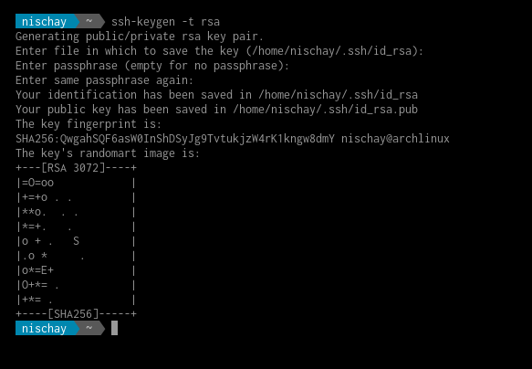

## Login and Accounts

### How to generate an SSH key pair?

An SSH key pair consists of two keys, namely, the public key and the private key. The public key is stored in the SSH directory of the HPC facility, while the private key remains with the user. Users are requested to safeguard the private key carefully. Note that the file name of the public key is same as the private key except that the public key has a file extension `.pub`. For example, if the file name of the SSH private key is `id_rsa`, then the file name of the public key would be `id_rsa.pub`.

#### On Windows: Using PuTTY

Users are recommended to use PuTTY to access SSH in Windows. The installer for PuTTY can be downloaded from [this](https://www.puttygen.com/download-putty) website. Within this link, please choose the MSI 64-bit ('Windows Installer for putty') version of the package.

-   Once installation is complete, go to
    `Start Menu -> All Programs -> PuTTYgen` and then launch the
    application. Figure [1](#PuTTY-gen){reference-type="ref"
    reference="PuTTY-gen"} shows the screenshot of the launched
    application.

-   For the type of key to generate, please select RSA and click
    **Generate**, and start moving the mouse within the Window. Putty
    uses the mouse movements to collect randomness. Note that on older
    machines, please select SSH-2 (RSA) if RSA is not available.

-   Once the progress bar becomes full, the actual key generation takes
    place. This process may take few seconds to several minutes. When
    complete, the public key should appear in the Window. You can
    specify a passphrase for the key (Optional).

-   Under Actions click on the **Save public key** and **Save private
    key** to save your public and private keys respectively.

-   Please share the public key with the system administrator, who will
    copy it to the SSH directory of the HPC facility.


#### On Windows: Using Windows 10 OpenSSH Client

Microsoft, from **Windows 10** build **1803** and onwards have shipped OpenSSH Client on all Windows 10 PCs. Users can use the OpenSSH `ssh-keygen` command to generate their SSH keys. The following steps will help in generating the SSH keys.

-   Press `Windows Key + R` to open the Windows Run Prompt.

-   Type `cmd` and press ENTER.

-   Type `ssh-keygen` in the console and press ENTER.

-   In order to generate the SSH key pair and store them securely,
    Windows may prompt you to enter a directory where the key pair will
    be stored. You may press Enter to choose the default location
    provided.

-   Next, you'll be prompted to enter your passphrase for the key
    (Optional).

-   Once the process is completed, two files will be generated along
    with the `SHA256` fingerprint. The key's random art image will also
    be displayed on-screen. A sample screenshot is shown in Figure
    [2](#windows-key-art){reference-type="ref"
    reference="windows-key-art"}. Note that the generated image and
    fingerprint will differ from system to system.

-   Please share the public key with the system administrator, who will
    copy it to the SSH directory of the HPC facility.


#### On macOS 

Users are recommended to use the `Terminal` application to generate ssh key pairs. It is located in the utilities which can be accessed using the Finder.

-   Open Terminal and enter `ssh-keygen -t rsa`.

-   This starts the key generation process. The utility may also prompt
    you to indicate where to store the key pair. Press ENTER to accept
    the default location.

-   Next, you'll be prompted to enter your passphrase for the key
    (Optional).

-   Once the process is completed, two files will be generated along
    with the `SHA256` fingerprint. The key's random art image will be
    displayed on-screen. A sample screenshot generated on a mac system
    is shown in Figure [3](#macOS-key){reference-type="ref"
    reference="macOS-key"}. Note that the generated image and
    fingerprint will differ from system to system.

-   Please share the public key with the system administrator, who will
    copy it to the SSH directory of the HPC facility.

    

#### On Linux

To generate `ssh` keys on a Linux based operating system,

-   Open a Terminal or Console and enter `ssh-keygen -t rsa`.

-   The utility will now prompt you to enter the location where to save
    the key pair. Press ENTER to accept the default location.

-   Next, you'll be prompted to enter your passphrase for the key
    (Optional).

-   Once the process is completed, two files will be generated along
    with the `SHA256` fingerprint. The key's random art image will also
    be displayed on-screen. A sample screenshot generated on a linux
    system is shown in Figure [4](#Linux-key){reference-type="ref"
    reference="Linux-key"}. Note that the generated image and
    fingerprint will differ from system to system.

-   Please share the public key with the system administrator, who will
    copy it to the SSH directory of the HPC facility.




### How to login to the HPC facility? 

Users can securely access the HPC facility using the `ssh` protocol.

#### On Windows: Using PuTTY

-   To launch PuTTY, go to `Start Menu -> All Programs -> PuTTY`.

-   When the program starts, a window titled **PuTTY configuration**
    should open.

-   Under **Connection** please expand **SSH**.

-   Select **Auth** and a new configuration pane should open on the
    left.

-   Under `Authentication Parameters`, you will find a **Browser**
    button. Click on it and select the file path of the Private SSH Key
    you generated.

-   Once the above process is completed, users can go back to
    **Session** Category. This window has a configuration pane on the
    right containing **Hostname (or IP address)** field.

-   Enter `hpc.bits-hyderabad.ac.in` in the **Hostname** field and click
    **Open**.

-   If this is the first time you are trying to login you might get a
    Security Alert. This is normal, and you should click **Yes**.

-   After the security alert, you should get a terminal window asking
    for username. Type the `username` provided to you by the HPC team to
    access the facility. If you have entered a `passphrase` for your ssh
    key pair, please type the password and press ENTER.

-   You should now be connected to the login node of the HPC facility.

Alternatively, users can click on the **Save** button in the Session category to save the SSH configuration. Users can then quickly connect to the login node by simply loading their saved configuration.

#### On Windows: Using Windows 10 OpenSSH Client

If you have already generated an SSH key pair using the OpenSSH Client, you can then directly access the login node by using the `Command Prompt`.

-   Press `Windows Key + R` to open the Windows Run Prompt.

-   Type `cmd` and press ENTER.

-   Type `ssh <username>@hpc.bits-hyderabad.ac.in` in the console and
    press ENTER. Here, `<username>` is the `username` provided to you by
    the HPC team to access the facility. If you have entered a
    `passphrase` for your ssh key pair please type the password and
    press ENTER.

-   You should now be connected to the login node of the HPC facility.

#### On macOS

Users are recommended to use the `Terminal` application to login using `ssh`. It is located in the utilities, which can be accessed using the Finder.

-   Open Terminal.

-   Type `ssh <username>@hpc.bits-hyderabad.ac.in` in the console and
    press ENTER. Here, `<username>` is the `username` provided to you by
    the HPC team to access the facility. If you have entered a
    `passphrase` for your ssh key pair please type the password and
    press ENTER.

-   You should now be connected to the login node of the HPC facility.

#### On Linux

-   Open a Terminal or Console.

-   Type `ssh <username>@hpc.bits-hyderabad.ac.in` in the console and
    press ENTER. Here, `<username>` is the `username` provided to you by
    the HPC team to access the facility. If you have entered a
    `passphrase` for your ssh key pair please type the password and
    press ENTER.

-   You should now be connected to the login node of the HPC facility.

### How do I add another SSH key to my account for remote acccess?

Users can add multiple SSH keys into their `authorized_keys` file of the HPC facility.

-   Open a terminal in the HPC facility.

-   Using `nano` or `vi` open `~/.ssh/authorized_keys`.

-   Append the contents of the new public key at the end of the file.
    Please ensure that the entire content of the public key fits in one
    single line with no additional spaces in between. Note that, each
    line in this file represents $1$ ssh key pair.

-   Save the file and exit. You should now be able to connect from the
    newly added machine.

Note: You are requested to copy the **public** key of the key pair and not the **private** key. Public key can be identified easily with the **.pub** file extension at the end of the the filename. For example `id_rsa.pub` refers to the public key and `id_rsa` refers to the private key.

### My ssh connection disconnects with "Write failed: Broken pipe\".

By default `ssh` enforces a maximum idle time after last input from user. This is a security precaution to protect the account from unauthorized access. A user can override this setting by configuring the `KeepAlive` directive, as explained below.

#### On Windows: Using PuTTY

-   Launch `PuTTY` from `Start Menu -> All Programs -> PuTTY`.

-   Select **Connection**.

-   In the configuration pane on the left you should find an option
    called `Seconds between keepalive`.

-   Enter in **seconds** the amount of time you would want as maximum
    idle time.

#### On Windows: Using Windows 10 OpenSSH Client

-   Open a file editor, preferably `Notepad`.

-   Type the following text without the `$` symbol. Example shown is for
    300 seconds and users can change this value accordingly.

    ``` {.bash}
    $ Host *
        ServerAliveInterval 300
    ```

-   Save this file as **config** under
    `C:\Users\<your username>\.ssh\config`.

#### Linux and macOS

-   Open a `Terminal`.

-   Using a file editor of your choice, type the following lines without
    the `$` symbol. Example shown is for 300 seconds and users can
    change this value accordingly.

    ``` {.bash}
    $ Host *
        ServerAliveInterval 300
    ```

-   Save this file as **config** under `~/.ssh/config`.

-   Make sure the file has **644** set as file system permission. If
    not, users can run `chmod 644 ~/.ssh/config` to set the file
    permissions.
